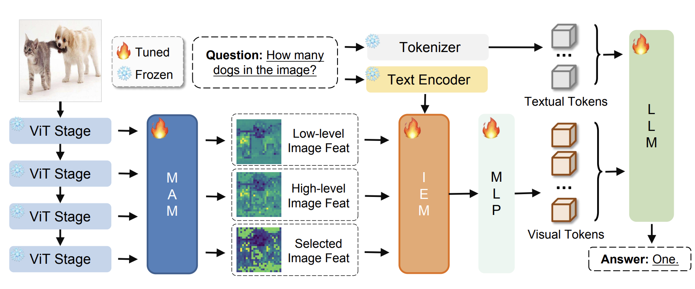
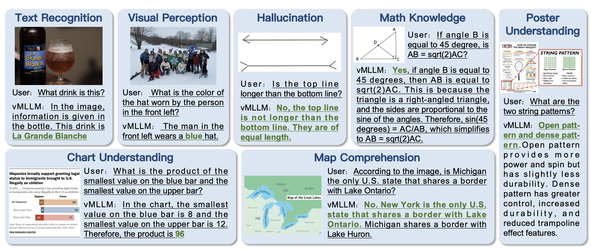

# vMLLM: Boosting Multi-modal Large Language Model with Enhanced Visual Features

This repository contains the reference code for the paper "vMLLM: Boosting Multi-modal Large Language Model with Enhanced Visual Features"



## Experiment setup

```
# create conda envs and install corresponding package
bash running_script/install_envs.sh
```

## Data preparation
- The image can be downloaded following the readme.md of following repos:
please refer to [LLaVA](https://github.com/haotian-liu/LLaVA/tree/main), [MG-LLaVA](https://github.com/PhoenixZ810/MG-LLaVA), and [MGM](https://github.com/dvlab-research/MGM)
- The merged annotation file can be downloaded from the [vMLLM_data](https://huggingface.co/datasets/xmu-xiaoma666/vMLLM_data/tree/main)

## Training
Training using CLIP-base vision encoder:
```
bash running_script/running_vMLLM_clip_base.sh
```

Training using CLIP-large vision encoder:
```
bash running_script/running_vMLLM_clip_large.sh
```

Training using SigLIP-base vision encoder:
```
bash running_script/running_vMLLM_siglip_base.sh
```

Training using SigLIP-SO vision encoder:
```
bash running_script/running_vMLLM_siglip_so.sh
```

## Chat Ability



## Performance

| **Method** | **VE**   | **LLM**         | **Res.** | **MMB** | **MM-Vet** | **MathVista** | **GQA** | **AI2D** | **SQA**$^{I}$ | **Seed**$^{I}$ | **VizWiz** |
|------------|----------|-----------------|----------|---------|------------|---------------|---------|----------|---------------|---------------|------------|
| vMLLM      | SigLIP-SO | Vicuna-7B       | 384      | 71.4    | 39.1       | 34.7          | 63.3    | 70.6     | 71.5          | 70.9          | 63.5       |
| vMLLM      | SigLIP-SO | Vicuna-13B      | 384      | 75.3    | 43.3       | 36.4          | 64.5    | 75.8     | 76.1          | 72.5          | 64.8       |
| vMLLM      | SigLIP-SO | LLaMA3-8B       | 384      | 77.1    | 43.4       | 41.0          | 65.3    | 77.1     | 75.6          | 74.0          | 65.1       |

## Model Zoo

| LLM | SFT  | Pretrain |
|-------|------|----------|
| Vicuna-7B  | [vMLLM_7B_sft](https://huggingface.co/xmu-xiaoma666/vMLLM_7B_sft)| [vMLLM_7B_pretrain](https://huggingface.co/xmu-xiaoma666/vMLLM_7B_pretrain)    |
| LLaMA3-8B  | [vMLLM_8B_sft](https://huggingface.co/xmu-xiaoma666/vMLLM_8B_sft) | [vMLLM_8B_pretrain](https://huggingface.co/xmu-xiaoma666/vMLLM_8B_pretrain)    |
| Vicuna-13B  | [vMLLM_13B_sft](https://huggingface.co/xmu-xiaoma666/vMLLM_13B_sft) | [vMLLM_13B_pretrain](https://huggingface.co/xmu-xiaoma666/vMLLM_13B_pretrain)     |

## Evaluation
We use the [lmms-eval](https://github.com/EvolvingLMMs-Lab/lmms-eval) toolkit for multi-benchmark evalution